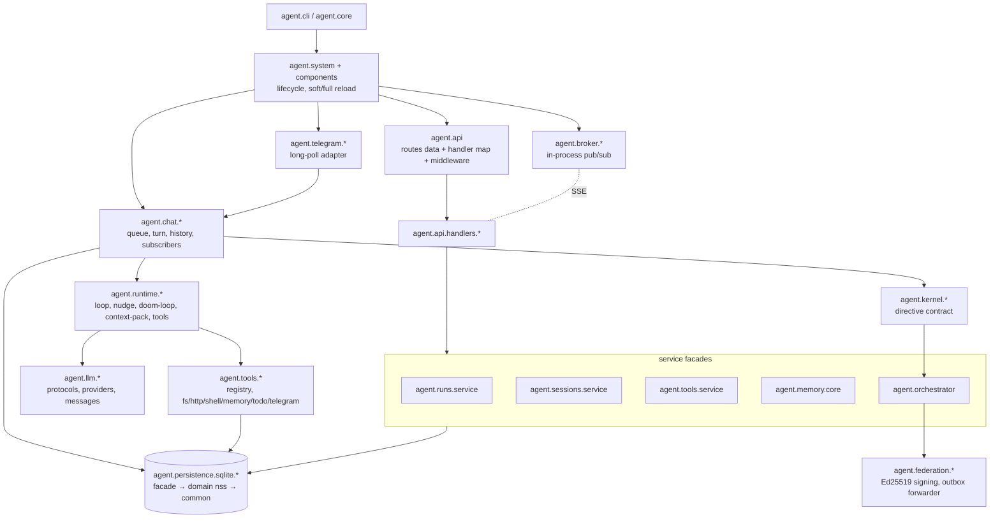

# Codebase Map — iris (clj-agent)

#architecture #reference
Generated: 2026-06-09 (deep review, 16-agent sweep over all 147 src namespaces). Companion notes: [[refactoring-2026-06-findings]], [[refactoring-2026-06-plan]].

## What it is

`iris` is a single-process Clojure LLM agent runtime: an HTTP API (reitit + http-kit), a SQLite store (HugSQL + HikariCP + ragtime), a Telegram long-polling adapter, a server-rendered Datastar web UI, and an evented agent loop (plan → guard → execute tools → emit) over pluggable LLM providers (Ollama, OpenAI-compatible/OpenRouter). ~22k LOC src, ~17k LOC test, 147 src namespaces, 51 test namespaces.

Entry: `agent.core` → `agent.cli` → either one-shot prompt or `agent.system/create-system` + `start-api!`.

## Layer diagram

## Key runtime flows

**Chat turn** (the core flow): `chat/run!` → `chat.queue` (per-session FIFO, manager lock) → `chat.turn/run-turn!` (composition root: history load + memory recall + context injectors + event subscribers + delta flusher) → `runtime.loop/run!` (plan via `agent.planner` → nudge/doom-loop guards → `runtime.tools/execute-batch!` → emit malli-validated events) → events fan out to `chat.subscribers` (persistence, streaming state) and the broker (SSE, Telegram drafts).

**Telegram**: long-poll `getUpdates` → `channel_inbox` dedupe row → allowlist → media normalization → `chat/run!` with a broker-event subscriber streaming drafts back; inline keyboards for tool approvals.

**Tool approval**: sensitive tool call → `tools.approvals` persists pending row (input-hash bound) → surfaced via API/UI/Telegram → decision → loop retries the call with approval id.

**Reload**: `/v1/system/reload` → `system/reload!` — `:soft` hot-swaps LLM/chat/tools/telegram in place; `:full` rebuilds the entire system map and restarts edges.

## Subsystems

### Entry & system lifecycle
Hand-wired component system (no integrant/component); a self-referential `:system-ref` atom enables reload. Global mutable state is confined to logging's publisher atom, nrepl's current-system atom, and `agent.loop`'s session registry.

| Namespace | LOC | Purpose |
|---|---|---|
| `agent.cli` | 345 | Arg parsing and command dispatch: serve, config init/migrate, skills, loop, one-shot/streamed prompts |
| `agent.core` | 9 | gen-class entrypoint; delegates to agent.cli/main |
| `agent.defaults` | 14 | Constants: LLM params, chat steps, truncation, buffer sizes |
| `agent.health` | 119 | Component health registry: status/last-ok/last-error/restart-count in an atom |
| `agent.logging` | 237 | μ/log bootstrap (file + OTel), rotation, sensitive-key redaction, log! helpers |
| `agent.nrepl` | 46 | Embedded nREPL with port-file + global current-system atom for dev |
| `agent.security` | 13 | constant-time= comparison (API-key auth) |
| `agent.streaming.metrics` | 27 | Atom-backed SSE counters for health endpoint |
| `agent.system` | 321 | Lifecycle: create, soft/full reload, API start, teardown |
| `agent.system.components` | 157 | Factories for every component + create-system-components |
| `agent.system.events` | 148 | Event broker + event-sink fns that persist, observe, trace, publish |
| `agent.system.health` | 83 | with-component-health wrappers + aggregate health-check |
| `agent.telemetry` | 513 | IObserver protocol + observers; in-memory metrics collector; complete-with-telemetry! (instrumented LLM call) |
| `agent.util` | 24 | now-str, duration-ms, result-content, emit! |

### Config
Layered loader: in-code defaults < global `~/.config/iris` < local `./.iris` < explicit `--config` < env vars; context markdown (SOUL/AGENTS/USER/…) concatenated global-then-local.

| Namespace | LOC | Purpose |
|---|---|---|
| `agent.config` | 785 | Layered config loading, include-aware EDN, legacy migration, validation, scaffolding, accessors |
| `agent.config.env` | 188 | Declarative table of ~70 typed env-var overrides |
| `agent.prompts` | 62 | Classpath prompt templates with {{var}} substitution + chat mode prompts |
| `agent.skills` | 213 | SKILL.md discovery, frontmatter parse, slash-command parsing, catalog |

### API (core + routes + handlers)
Pure route data (`agent.api.routes.*`, malli `:parameters`, `:handler/id` markers) bound to handler closures in `agent.api`; startup assertion guarantees 1:1 route↔handler binding, so there are no dead routes. Middleware: request-id, error boundary, logging, constant-time API-key auth.

| Namespace | LOC | Purpose |
|---|---|---|
| `agent.api` | 289 | Composition root: handler map, router, middleware, http-kit server |
| `agent.api.errors` | 60 | api-error constructors + domain ex-data :type → API error mapping |
| `agent.api.event-compat` | 41 | Legacy persisted event-type normalization shim |
| `agent.api.helpers` | 92 | JSON/form body readers, header lookup, bearer extraction |
| `agent.api.middleware` | 95 | request-id, error boundary, logging, API-key auth |
| `agent.api.responses` | 70 | json/html/bytes responses + error renderer |
| `agent.api.routes` | 29 | Concatenates 12 route-data namespaces |
| `agent.api.schemas` | 81 | Shared malli schemas for :parameters |
| `agent.api.serializers` | 232 | kebab→snake_case response transforms (20 hand-written fns) |
| `agent.api.streaming` | 201 | Managed SSE context: subscriptions, auto-unsubscribe, workers, frames |
| `agent.api.routes.*` | 570 | 12 pure-data route namespaces (agents, channels, chat, events, federation, memory, providers, root, runs, sessions, tools, ui) |
| `agent.api.handlers.*` | ~1900 | 17 handler namespaces; mostly thin delegation to service facades; `ui.clj` (564) is the god-namespace outlier |

### Chat
Layered front-end over the runtime loop. `agent.chat` facade → `chat.queue` (per-session FIFO) + `chat.service` (executors, session/streaming atoms) → `chat.turn` composition root.

| Namespace | LOC | Purpose |
|---|---|---|
| `agent.chat` | 31 | Public facade (run!, cancel-session!, session-state, streaming-state) |
| `agent.chat.history` | 200 | Message persistence, LLM history shaping, queued-message lifecycle |
| `agent.chat.kernel-ops` | 62 | ChatKernelOps record; routes tool exec through chat permission profile |
| `agent.chat.loop-control` | 73 | /loop command handling + background loop worker |
| `agent.chat.memory` | 82 | Memory recall for prompt injection + post-turn fact extraction |
| `agent.chat.queue` | 175 | Run-or-enqueue, drain-next, cancellation |
| `agent.chat.service` | 195 | Service state container + lifecycle + session-state snapshots |
| `agent.chat.streaming` | 95 | Delta coalescing (50ms flush windows) |
| `agent.chat.subscribers` | 123 | Runtime-event subscribers: persistence, streaming accumulation |
| `agent.chat.turn` | 258 | Single-turn composition root wiring everything into runtime.loop |
| `agent.chat.util` | 38 | Event emission helpers |

### Runtime (agent loop)
Transport- and persistence-free loop machinery; communicates through malli-validated events to a pluggable sink. `agent.chat.turn` is the sole production composer. NOTE: `agent.loop` (the `/loop` self-iteration feature) is NOT a legacy twin of `agent.runtime.loop` — name collision only.

| Namespace | LOC | Purpose |
|---|---|---|
| `agent.runtime.cancel` | 22 | Polymorphic cancellation tokens |
| `agent.runtime.compaction` | 172 | Persistent session-entry compaction (per-turn auto-compact!) |
| `agent.runtime.context-pack` | 395 | Per-call transient context shrinking + token budget report |
| `agent.runtime.doom-loop` | 101 | Repeated-identical-tool-call guard (canonicalize → SHA-256 → window) |
| `agent.runtime.events` | 108 | Schema-validated event emission helpers |
| `agent.runtime.loop` | 523 | The evented agent loop: run! |
| `agent.runtime.messages` | 183 | Terminal-content constants, tool-protocol messages, history repair |
| `agent.runtime.nudge` | 296 | Small-model retry governor (invalid-turn classification + NUDGE msgs) |
| `agent.runtime.schema` | 403 | Malli contracts for blocks/turns/events + content-block normalization |
| `agent.runtime.tokens` | 10 | chars/4 token estimator |
| `agent.runtime.tool-router` | 97 | Small-model tool schema reducer (+ synthetic :respond tool) |
| `agent.runtime.tools` | 345 | Batch tool execution: preflight, sequential/parallel, receipts |
| `agent.runtime.trace` | 170 | Privacy-scrubbed JSONL trace (none/rolling/full) |

### LLM
Protocols in `agent.llm.core`; two providers; wire-format conversion in `agent.llm.messages`; DSML leaked-tool-call recovery; capability registry; factory in `agent.llm.service`. Production routes exclusively through `ILLMProviderInvoke.invoke` — the string `complete` API is legacy.

| Namespace | LOC | Purpose |
|---|---|---|
| `agent.llm.core` | 277 | Protocols, response normalization, retry/backoff, error helpers |
| `agent.llm.dsml` | 126 | Recovers tool calls leaked as DSML markup; guards streaming deltas |
| `agent.llm.messages` | 373 | Internal blocks ↔ provider wire shapes (chat, Responses, Ollama) |
| `agent.llm.providers.common` | 94 | Shared HTTP: retried post-json, post-stream, stream channel |
| `agent.llm.providers.ollama` | 278 | Native Ollama (NDJSON /api/chat, /api/embed, /api/tags) |
| `agent.llm.providers.openai-compatible` | 395 | Chat Completions + Responses + OpenRouter preset |
| `…openai-compatible.parse` | 95 | Non-streaming response → turn parsers |
| `…openai-compatible.request` | 182 | Request-body builders (defaults, cache fields, structured output) |
| `…openai-compatible.stream` | 173 | SSE accumulators with tool-call-delta merging |
| `…openai-compatible.usage` | 28 | Usage payload normalization |
| `agent.llm.registry` | 226 | Config-driven capability registry (feeds /v1/providers; display-only) |
| `agent.llm.service` | 73 | Provider factory dispatched on config :type |

### Tools
Protocol-based registry with a single heavyweight `execute-tool` pipeline; six builtin families + system-reload tool; SQLite-persisted approvals; batch/parallel execution lives in `agent.runtime.tools` (double-enforcement seam via `:preflighted?`).

| Namespace | LOC | Purpose |
|---|---|---|
| `agent.mcp.core` | 336 | MCP Streamable-HTTP client + JSON-Schema→malli (production-unwired except envelope helper) |
| `agent.tools.approvals` | 193 | Approval workflow: request/approve/deny, input-hash binding, policy hook |
| `agent.tools.common.fs` | 326 | 7 fs tools sandboxed to roots, symlink rejection, NOFOLLOW I/O |
| `agent.tools.common.http` | 234 | HTTP tool with SSRF defenses (private-IP block, pinned DNS, size cap) |
| `agent.tools.common.memory` | 381 | fact search/save/remove, vault read/write, message_search |
| `agent.tools.common.shell` | 285 | Shell tool: root-bounded cwd, glob rule engine, hardcoded denies |
| `agent.tools.common.telegram` | 162 | Outbound Telegram tools (photo/document/keyboard) |
| `agent.tools.common.todo` | 168 | Session-scoped todo tools |
| `agent.tools.core` | 537 | Registry kernel: ITool, BasicTool, descriptions, execute-tool pipeline |
| `agent.tools.display` | 147 | Per-channel tool call/result formatting |
| `agent.tools.service` | 238 | Production registry wiring + policy/telemetry/trace/activity hooks |

### Persistence
Facade (`agent.persistence.sqlite`) is the sole entry point (verified: no consumer bypasses it). Domain namespaces over shared plumbing (`common`: HikariCP, PRAGMAs, retry, tx serialization); SQL in HugSQL files; ragtime migrations with checksum drift detection.

| Namespace | LOC | Purpose |
|---|---|---|
| `agent.persistence.sqlite` | 347 | Facade: lifecycle + ~90 one-line delegations |
| `…sqlite.common` | 248 | Pool, PRAGMAs, retry, with-connection/transaction, JSON, FTS5, limits |
| `…sqlite.events` | 88 | Append-only agent_events: insert, list, FTS search, cursor |
| `…sqlite.federation` | 190 | Peer keys, nonces, delivery outbox FSM |
| `…sqlite.memory` | 186 | Fact triples: normalize, dedupe-on-save, scoped search |
| `…sqlite.migrations` | 234 | Baseline descriptor, SQL splitter, checksums, ragtime adapters |
| `…sqlite.runs` | 525 | Runs FSM, leases, heartbeats, commands, checkpoints, activities |
| `…sqlite.schema` | 40 | Misnamed health/stats namespace (being dissolved) |
| `…sqlite.sessions` | 602 | Sessions, messages, session_entries DAG, completions, channel mappings |
| `…sqlite.todos` | 179 | Todo lists with strict item validation |
| `…sqlite.tools` | 100 | Tool-approval rows |

### Telegram + Web UI
| Namespace | LOC | Purpose |
|---|---|---|
| `agent.telegram` | 460 | Long-polling adapter, update routing, chat-run orchestration, lifecycle |
| `agent.telegram.api` | 198 | Bot API HTTP client |
| `agent.telegram.approvals` | 193 | Inline-keyboard approvals |
| `agent.telegram.commands` | 118 | Slash commands |
| `agent.telegram.format` | 222 | Markdown → MarkdownV2 (streaming-safe) |
| `agent.telegram.media` | 168 | Inbound media → base64 LLM blocks |
| `agent.telegram.sessions` | 34 | Chat ↔ session mapping |
| `agent.telegram.streaming` | 111 | Draft streaming, thinking blockquote, typing loop |
| `agent.ui` | 865 | Datastar UI fragments (sessions/chat/runs/tools/approvals/events/logs) |
| `agent.ui.memory` | 204 | Memory workspace fragments |
| `agent.ui.render` | 477 | Hiccup render core, sanitized markdown, message rendering |

### Orchestration / federation / runs / kernel / memory
| Namespace | LOC | Purpose |
|---|---|---|
| `agent.broker.core` | 76 | IBroker protocol, subject naming/wildcards |
| `agent.broker.local` | 108 | In-process IBroker (per-subscriber channels, slow-client policies) |
| `agent.channels.core` | 190 | IChannelAdapter contracts + registry |
| `agent.federation.auth` | 86 | Inbound verification: skew, key window, Ed25519, nonce replay |
| `agent.federation.crypto` | 80 | Ed25519 keypair + canonical-JSON signing |
| `agent.federation.forwarder` | 306 | Durable outbox + delivery daemon (rate limit, circuit breaker) |
| `agent.kernel` | 49 | Pure directive contract |
| `agent.kernel.ops` | 16 | KernelOps protocols |
| `agent.kernel.runtime` | 242 | Executes directives against a KernelOps host |
| `agent.kernel.schema` | 121 | Malli schemas for directives/receipts/steps |
| `agent.kernel.service` | 135 | SystemKernelOps binding kernel to system map |
| `agent.loop` | 291 | /loop command state (NOT the agent loop) |
| `agent.memory.core` | 454 | Memory facade: surfaces, fact store, lexical search, vault, extraction |
| `agent.memory.schema` | 59 | Scope normalization + fact validation |
| `agent.orchestrator` | 1046 | In-memory multi-agent runtime (atom-backed; experimental, env-gated) |
| `agent.planner` | 112 | Native tool-calling planner |
| `agent.runs.registry` | 524 | Durable run control plane (FSM, leases, reclaim) |
| `agent.runs.service` | 114 | System-map facade over runs.registry |
| `agent.sessions.service` | 80 | Session store facade |

## Inter-subsystem dependencies (require-graph, aggregated)

- `system` → everything (composition root). `api` → handlers → service facades. Verified: **all 147 src namespaces reachable from agent.core**; no dead namespaces.
- Known inversions (see [[refactoring-2026-06-findings]]): `telemetry` → `llm.core` + `runtime.trace` (telemetry executes LLM calls); `tools.service` → `orchestrator`; `llm.messages` → `runtime.schema` (schema is really shared infrastructure).
- `agent.persistence.sqlite` facade discipline holds everywhere **except** a few API handlers and chat nss that call it directly (layering leak, tracked in findings).

## Test landscape

- Runner: `test/agent/test_runner.clj` — hardcoded ns list (no auto-discovery); wraps everything in a temp config dir.
- Strong coverage (safe to refactor): `runtime.loop` (17 deftests + e2e), `llm.providers.*` (39 deftests, mocked HTTP), `persistence.sqlite` facade (heavily characterized), `chat` facade (44 deftests via predictable fake provider), `telegram` adapter (892-line test).
- Facade-only coverage (refactor behind facade only): `chat.{turn,service,queue,history,subscribers}`, sqlite sub-namespaces, api handlers (status + shape smoke only).
- Dark spots: `agent.security`, `agent.util`, `runtime.tokens`, `streaming.metrics`, `telegram.{commands,media,sessions}`, `federation.{auth,crypto}` (only via http facade).

## Operational notes

- Tests: `env IRIS_CONFIG_DIR=target/test-iris-config IRIS_DATA_DIR=target/test-iris-data clojure -M:test -e "(require 'agent.test-runner) (agent.test-runner/run-all-tests) (shutdown-agents)"` (add `-J-Djava.io.tmpdir=$PWD/target/test-tmp` in sandboxed environments).
- Lint: `clj-kondo --lint src test` (configure `:lint-as`/hugsql to silence `*-sqlvec` false positives).
- Build: `clojure -T:uberjar uberjar`; deploy via `scripts/deploy-jar.sh`.
